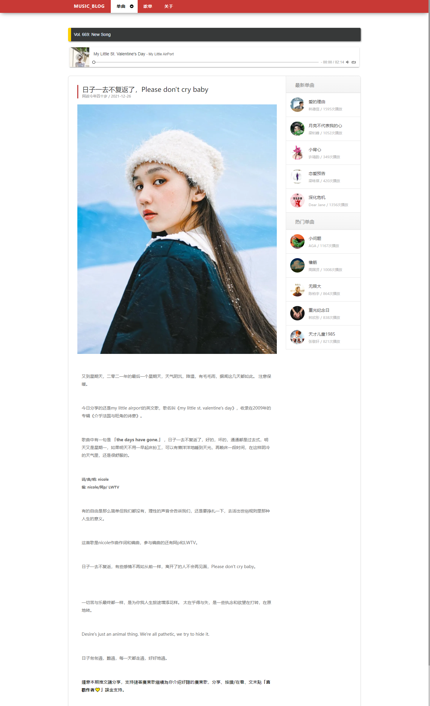

# MusicBlog
应付课程设计、期末项目、UI设计课程作业，页面包括首页，列表页，详情页，关于页

兼容ie，只有轮播图和播放器插件用到js

## Home_Page

## Detail_Page

## PlayList_Page

## About_Page

## ToDoList

- [x] 播放器插件
- [x] about_page
- [x] playlist_page
- [x] detail_page

## 注意
文章内容来源于网络，内容请勿商用，请支持正版，请尊重版权。
